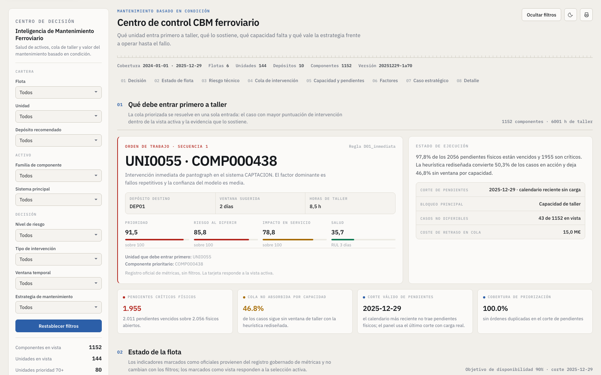
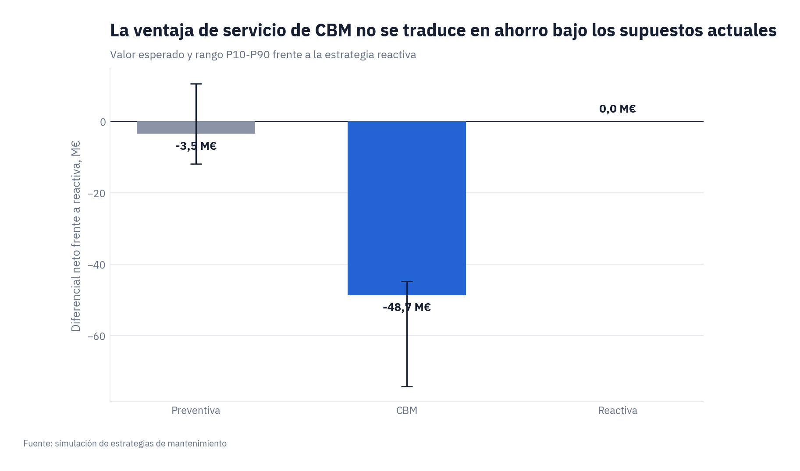
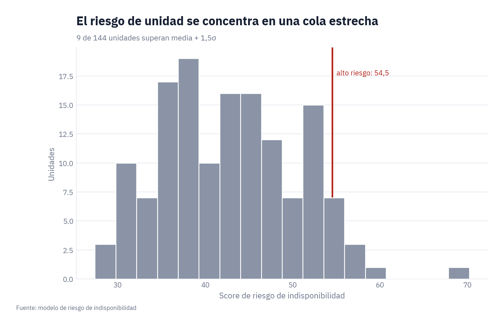
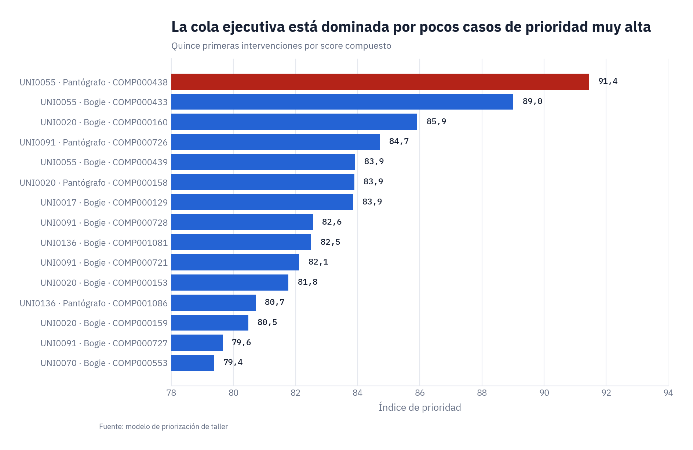
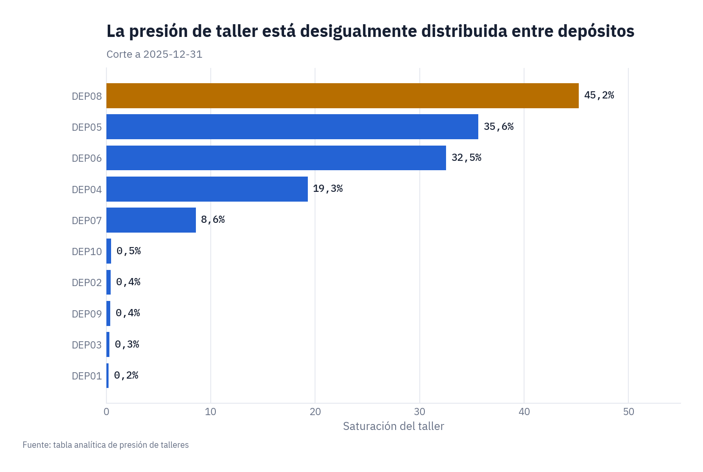

<div align="center">

# Inteligencia de Mantenimiento Ferroviario · CBM

### Sistema de decisión para flotas ferroviarias basado en condición

Prioriza qué componente entra a taller primero, cuantifica el riesgo económico y operativo de diferir cada
intervención, y mide el valor del mantenimiento basado en condición frente a operar hasta el fallo.

[](https://github.com/mfidalgomartins/inteligencia-mantenimiento-ferroviario-cbm/actions/workflows/ci.yml)
[](LICENSE)
[](pyproject.toml)
[](scripts/run_coverage.sh)

[](https://mfidalgomartins.github.io/inteligencia-mantenimiento-ferroviario-cbm/)
[](outputs/reports/informe_analitico_cbm_ferroviario.pdf)



*Panel de control real generado por el propio sistema — no una maqueta. Datos: flota sintética de 144 unidades.*

</div>

## Resumen ejecutivo

Una red de 144 unidades y 1.152 componentes críticos genera más pendientes de taller de los que la capacidad
disponible puede absorber a tiempo. El sistema convierte sensores, inspección, historial de fallos y órdenes de
mantenimiento en una única cola de decisión: qué intervenir primero, en qué depósito y con qué evidencia.

| Métrica | Valor |
|---------|------:|
| Disponibilidad media de flota | **95,75 %** |
| Unidades de alto riesgo (≥ media + 1,5σ) | **9** |
| Pendientes físicos | **2.056 pendientes** |
| Pendientes vencidos | **2.011 pendientes** |
| Pendientes críticos físicos | **1.955 pendientes** |
| Casos de alto riesgo de diferimiento | **43** |
| Mejora de disponibilidad CBM vs reactiva | **+0,93 p.p.** |
| Coste incremental aproximado CBM vs reactiva | **€ 48.700.525** |

**Decisión gobernada por el sistema en este corte:** intervenir primero la unidad `UNI0055`, componente `COMP000438` (pantógrafo, sistema de captación), con evidencia y ventana de taller trazables en el panel.

**Lectura económica honesta:** en el escenario base actual, CBM todavía cuesta más que operar hasta el fallo —
el valor está en la disponibilidad y en la reducción de riesgo, no (todavía) en el ahorro directo. El sistema lo
declara explícitamente en lugar de forzar un caso de negocio favorable; el [análisis de sensibilidad completo](docs/maintenance_strategy_comparison_framework.md)
muestra bajo qué condiciones de madurez operativa el caso económico se vuelve positivo.

## Qué resuelve

- Integra sensores, inspección automática, fallos y mantenimiento para puntuar 1.152 componentes.
- Ordena y secuencia la cola de taller según riesgo técnico, impacto de servicio, capacidad y ventana operativa.
- Compara CBM, preventiva rígida y reactiva con supuestos económicos explícitos y análisis de sensibilidad.
- Mantiene trazabilidad desde los datos hasta las métricas ejecutivas y bloquea el flujo ante validaciones críticas.

## Análisis

<table>
<tr>
<td width="50%">



</td>
<td width="50%">



</td>
</tr>
<tr>
<td>



</td>
<td>



</td>
</tr>
</table>

## Panel de control

HTML autocontenido sin dependencias externas ni llamadas de red: funciona completamente sin conexión (captura en
la cabecera de esta página). Arquitectura en pirámide invertida — abre con la orden de trabajo prioritaria y su
evidencia, no con un muro de gráficos.

- Filtros cruzados por flota, depósito, familia de componente, sistema, nivel de riesgo, tipo de intervención y ventana temporal.
- Procedencia visible en cada indicador: `oficial` (registro gobernado de métricas) frente a `vista` (recorte por filtro activo).
- Ocho secciones de lectura: decisión, estado de flota, riesgo técnico, cola de intervención, capacidad y pendientes, factores, caso estratégico y detalle.
- Modo claro/oscuro y exportación a impresión, con tipografía embebida para paridad visual exacta.
- Verificado con validador de contraste y visión cromática: contraste de marca >3:1 y ΔE ≥12 bajo protanopia y deuteranopia.

**[Abrir el Dashboard en Vivo →](https://mfidalgomartins.github.io/inteligencia-mantenimiento-ferroviario-cbm/)**

## Informe analítico

<table>
<tr>
<td width="38%">


</td>
<td width="62%">

Documento ejecutivo en PDF que acompaña al panel con el razonamiento completo: riesgo y priorización de taller,
vida remanente operativa, comparación de estrategias de mantenimiento y disciplina económica del caso CBM.

- Lectura ejecutiva en la portada con la decisión inmediata, antes de cualquier detalle técnico.
- Mismo registro oficial de métricas que el panel — cero divergencia entre lo narrado y lo mostrado.
- Diseño visual auditado a estándar de consultoría (tipografía, paleta y jerarquía consistentes con el panel).
- Generado de forma determinista con WeasyPrint a partir de HTML/CSS versionado, sin edición manual.

El enlace abre la vista previa de PDF integrada de GitHub, sin necesidad de descargar el archivo.

**[Leer el Informe Analítico (vista previa PDF) →](outputs/reports/informe_analitico_cbm_ferroviario.pdf)**

</td>
</tr>
</table>

## Arquitectura

```
datos sintéticos → preparación SQL → tablas analíticas → puntuación → priorización → panel de control
```

1. Datos sintéticos deterministas de operación, sensores, fallos, inspección y mantenimiento.
2. Capa SQL DuckDB por etapas: preparación, integración, tablas analíticas e indicadores.
3. Ingeniería de variables para salud de componente, RUL operativo y puntuación de prioridad.
4. Priorización y planificación heurística con capacidad de taller.
5. Comparativa estratégica y análisis de diferimiento.
6. Panel de control sin conexión alimentado por el registro oficial de métricas.

## Reproducir
Requiere Python 3.12 o superior.

```bash
python3 -m venv .venv
source .venv/bin/activate
python -m pip install -r requirements-lock.txt
./scripts/run_pipeline.sh
./scripts/run_tests.sh
./scripts/run_coverage.sh
```
El flujo usa semilla fija y regenera datos, métricas, documentación derivada y panel de control.

## Estructura

```
src/railway_cbm/  paquete instalable: datos, SQL, puntuación, planificación y panel de control
sql/               capa SQL por etapas (preparación → integración → tablas analíticas → indicadores)
notebooks/         análisis exploratorio por fase del flujo
scripts/           ejecución del flujo, pruebas y publicación
outputs/           panel de control, gráficos PNG e informe PDF
tests/             validaciones de calidad, métricas y consistencia
docs/              reproducibilidad, supuestos, gobierno de métricas y preparación productiva
assets/            tipografía embebida y capturas de referencia del panel/informe
```

Documentación técnica: [reproducibilidad](docs/reproducibility.md) · [arquitectura del repositorio](docs/repo_architecture.md) · [preparación productiva](docs/production_readiness.md) · [seguridad y dependencias](docs/security_dependency_hygiene.md) · [marco RUL](docs/rul_framework.md) · [gobierno de métricas](docs/gobierno_metricas.md)

## Hoja de ruta

El núcleo batch (datos → riesgo → priorización → panel) está implementado y gobernado por puertas de calidad. El
avance hacia operación real sigue tres fases, sin saltos: cada una exige responsable, umbral y evidencia de
aceptación antes de habilitar la siguiente ([detalle completo](docs/production_readiness.md)).

| Fase | Objetivo | Bloqueo actual |
|------|----------|----------------|
| **P0 — Evidencia real** | Cargar histórico autorizado vía `--source external` y recalibrar umbrales con Fiabilidad, Operaciones y Finanzas. | Ejecución publicada usa datos sintéticos; `model_deployment_gate.csv` exige fuente externa. |
| **P1 — Piloto en sombra** | Orquestar en producción, registrar aprobaciones humanas y comparar recomendaciones contra decisiones reales a 30/60/90 días. | Requiere un histórico con seis cortes maduros y ≥30 fallos observados. |
| **P2 — Operación controlada** | Integrar identidad y roles, conectar el registro aprobado con EAM/ERP, y ampliar el MILP con repuestos y habilidades. | Requiere piloto P1 validado con SLA y plan de reversión definidos. |

El sistema nunca ejecuta acciones de forma autónoma: la autoejecución permanece desactivada por diseño en las tres fases.

## Limitaciones
- Todos los datos son sintéticos; los umbrales requieren calibración antes de uso operacional.
- Los costes y ahorros son aproximaciones de escenario, no estimaciones financieras contractuales.
- El RUL sirve como ventana relativa de intervención; su asociación con fallo a 30 días es débil y no representa una fecha de fallo calibrada.
- La planificación es heurística y no garantiza una solución global óptima.

## Tecnologías
Python · SQL · DuckDB · pandas · matplotlib · pytest · pytest-cov · HTML/CSS/JavaScript

## Licencia
MIT.
