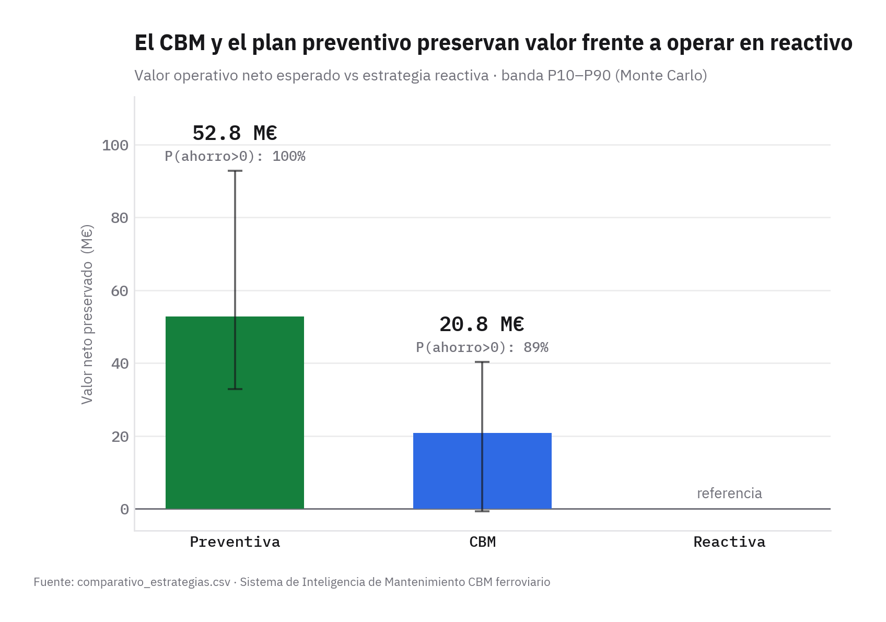
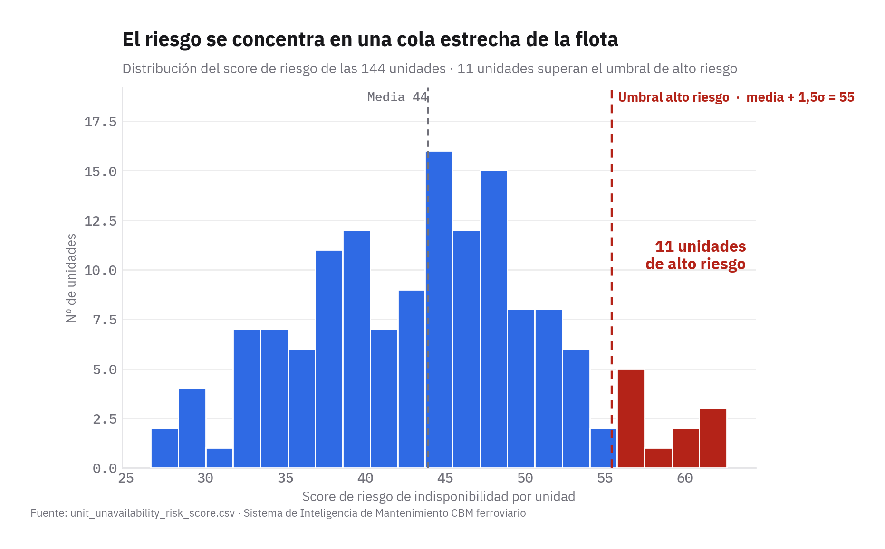
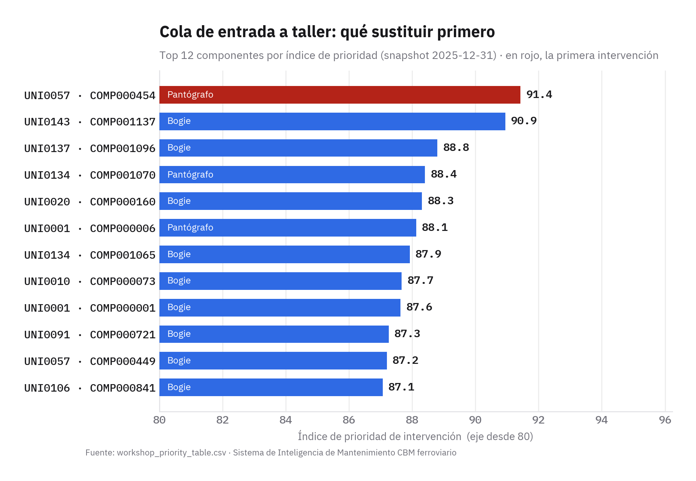
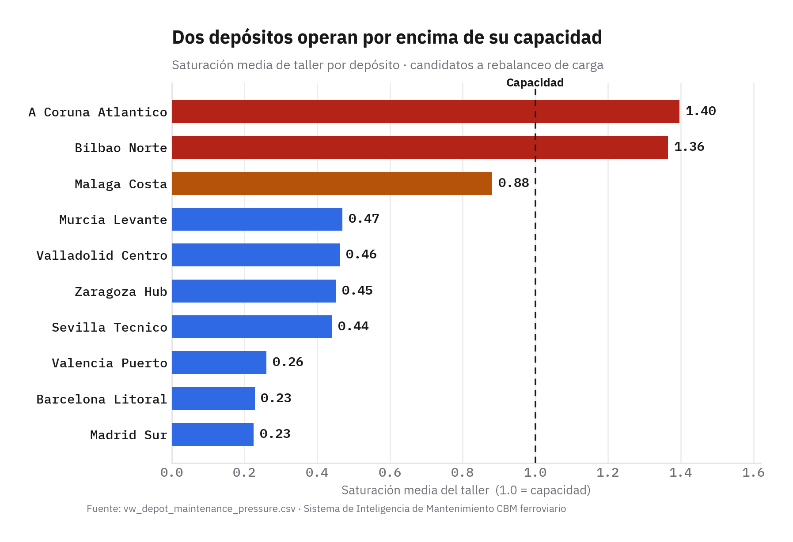

# Inteligencia de Mantenimiento Ferroviario — CBM

Plataforma de decisión para flotas ferroviarias: prioriza intervenciones de taller, cuantifica el riesgo de diferir cada decisión y mide el valor del mantenimiento basado en condición frente a una estrategia reactiva.

**[→ Dashboard en vivo](https://mfidalgomartins.github.io/inteligencia-mantenimiento-ferroviario-cbm/)** &nbsp;·&nbsp; Python · SQL · DuckDB · HTML offline

---

## Resultados — flota de 144 unidades

| Métrica | Valor |
|---------|------:|
| Disponibilidad media de flota | **90,45 %** |
| Unidades de alto riesgo (≥ media + 1,5σ) | **11** |
| Backlog crítico físico | **1.957 órdenes** |
| Ahorro operativo proxy CBM vs reactiva | **€ 20.764.476** |
| Mejora de disponibilidad CBM vs reactiva | **+2,08 p.p.** |
| Casos de alto riesgo de diferimiento | **64** |

Unidad prioritaria: `UNI0057` &nbsp;·&nbsp; Componente prioritario: `COMP000454`

---

## Qué hace

- **Scoring de riesgo sobre 1.152 componentes**, integrado desde señales de sensor, inspección automática y registros de mantenimiento. Identifica las 11 unidades en umbral crítico y las ordena por urgencia de intervención.
- **Cola de taller priorizada y secuenciada**: ordena las intervenciones por score de riesgo, ventana operativa y capacidad de depósito. Calcula el coste incremental de diferir cada decisión.
- **Comparativa estratégica CBM vs reactiva**: cuantifica el valor operativo del CBM con análisis de sensibilidad e intervalo plausible de ahorro (de −€628k a +€40,3M según parámetros de coste).

---

## Análisis

<table>
<tr>
<td width="50%">



</td>
<td width="50%">



</td>
</tr>
<tr>
<td>



</td>
<td>



</td>
</tr>
</table>

---

## Dashboard

HTML autocontenido sin dependencias externas. Funciona offline y reproduce los mismos resultados con semilla fija. Incluye filtros por flota, depósito, familia y sistema; paginación; y modo claro/oscuro. 50 tests de QA automatizados validan estructura, métricas y rendimiento antes de cada publicación.

**→ [Abrir dashboard en vivo](https://mfidalgomartins.github.io/inteligencia-mantenimiento-ferroviario-cbm/)**

---

## Arquitectura

```
datos sintéticos → staging SQL → marts → KPIs → scoring → priorización → dashboard
```

1. **Datos** — flota sintética con señales de sensor, fallos, inspección y registro de mantenimiento (semilla fija, pipeline determinista).
2. **SQL por capas** — staging → marts → KPIs con DuckDB; trazabilidad completa desde señal técnica hasta indicador.
3. **Feature engineering** — índice de salud de componente, RUL operativo, score de prioridad interpretable.
4. **Priorización** — cola de taller con scheduling heurístico y análisis de diferimiento por unidad.
5. **Comparativa estratégica** — CBM vs reactiva con sensibilidad de costes e intervalo de confianza.
6. **Dashboard** — HTML offline, light + dark mode, KPIs gobernados por SSOT versionado.

---

## Ejecución

```bash
pip install -r requirements.txt
python -m src.run_pipeline   # genera datos, modelos, métricas y dashboard
pytest -q                    # 50 checks de consistencia y QA
```

El pipeline es determinista: la misma semilla reproduce exactamente los mismos datos, scores y cifras del dashboard.

---

## Estructura

```
src/          lógica de datos, scoring y generador del dashboard
sql/          capa SQL por capas (staging → marts → KPIs)
notebooks/    análisis exploratorio por fase del pipeline
scripts/      ejecución del pipeline y generación de charts
outputs/      dashboard HTML y gráficos PNG para publicación
tests/        50 validaciones de QA (estructura, métricas, rendimiento)
docs/         memo ejecutivo y contratos de métricas (SSOT)
```

---

## Limitaciones

- Datos sintéticos; requieren calibración con históricos reales de operaciones.
- Costes económicos en proxy; no reflejan contratos de taller ni tarifas reales.
- Scheduling heurístico, no optimizador global (sin ILP ni programación entera).

---

## Stack

Python · SQL · DuckDB · pandas · matplotlib · pytest · HTML/CSS/JavaScript
