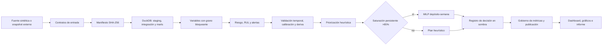

# Arquitectura del repositorio

## Ruta oficial

- Paquete: `src/railway_cbm/`.
- CLI: `railway-cbm` (`railway_cbm.cli:main`).
- Orquestador: `src/railway_cbm/run_pipeline.py`.
- Envoltorio de ejecución y publicación: `scripts/run_pipeline.sh`.
- Dialecto analítico: DuckDB SQL en `sql/01_*.sql` a `sql/11_*.sql`.
- Panel canónico: `outputs/dashboard/centro-control-mantenimiento-ferroviario.html`.

## Flujo de datos y decisión



## Capas y contratos

| Capa | Implementación | Salida oficial | Control principal |
|------|----------------|----------------|-------------------|
| Entrada | `ingestion.py`, `generate_synthetic_data.py` | `data/raw/*.csv` | esquema, PK, FK, UTF-8 y fechas |
| Linaje | `ingestion.py`, `run_pipeline.py` | `input_data_manifest.csv`, `pipeline_execution_manifest.csv` | SHA-256, cardinalidad y estado por etapa |
| SQL | `run_sql_layer.py`, `sql/*.sql` | `mart_*`, `vw_*`, `kpi_*`, `val_*` | validaciones SQL bloqueantes |
| Variables | `feature_engineering.py` | `component_day_features.csv`, `unit_day_features.csv` | unicidad componente-día y semántica de signos |
| Modelo | `risk_scoring.py`, `rul_estimation.py`, `model_monitoring.py` | scores, RUL, validación temporal, deriva y puerta de despliegue | cortes maduros, no fuga y umbrales de readiness |
| Taller | `workshop_prioritization.py`, `capacity_optimization.py` | plan heurístico, pruebas de estrés y asignación MILP | capacidad finita y puerta >85 % |
| Decisión | `decision_governance.py` | `decision_register.csv`, `decision_review_register.csv` | modo sombra, revisión humana y autoejecución desactivada |
| Publicación | `reporting_governance.py`, `build_dashboard.py`, scripts de informe | HTML, 19 PNG y PDF | contratos, consistencia narrativa y artefactos únicos |

## Fuentes

### Sintética

`railway-cbm run --source synthetic --seed 42` genera una red determinista para probar el sistema completo. Esta fuente nunca habilita uso autónomo.

### Externa

`railway-cbm run --source external --input-dir ...` valida las 15 tablas canónicas antes de limpiar el área gestionada. La fuente debe permanecer fuera de `data/raw/`. El archivo opcional `decision_approvals.csv` incorpora revisiones humanas con identidad, estado, revisor, fecha y comentario.

## Puertas de decisión

1. **Datos:** no se carga un snapshot que incumpla esquema, PK, FK o fechas.
2. **SQL:** las reconciliaciones, rangos y cardinalidades deben ser cero-error.
3. **Modelo:** el uso autónomo exige fuente externa, seis cortes maduros, al menos 30 fallos, ROC AUC ≥0,65, error de calibración ≤0,10 y PSI máximo <0,25.
4. **Capacidad:** el MILP sólo se ejecuta con utilización ≥85 %, al menos 10 % de días-depósito saturados y casos pendientes por capacidad.
5. **Decisión:** el modo sombra y la autoejecución desactivada son controles bloqueantes.
6. **Publicación:** contratos de datos y métricas deben pasar antes de construir el panel.

## Límites operativos

El núcleo admite snapshots externos, pero el repositorio no incluye conectores a sistemas fuente, almacén remoto, identidad, secretos, reintentos distribuidos ni integración con ERP/EAM. Esas responsabilidades pertenecen a la plataforma de despliegue. El dashboard continúa siendo un artefacto estático sin escritura operacional.

## Convenciones

- `data/raw/` y `data/processed/` son áreas gestionadas y regenerables.
- `outputs/` contiene únicamente artefactos publicables finales.
- Las métricas visibles consumen fuentes registradas en `docs/gobierno_metricas.md`.
- `prob_fallo_30d` conserva un nombre histórico, pero es un score relativo hasta que la calibración externa supere la puerta.
- La asignación MILP es una recomendación de capacidad en sombra, no una orden de trabajo.

## Puertas de cambio

```bash
./scripts/run_pipeline.sh
./scripts/run_tests.sh
./scripts/run_coverage.sh
git diff --check
```

## Ruta de lectura

1. `README.md`
2. `docs/repo_architecture.md`
3. `src/railway_cbm/run_pipeline.py`
4. `docs/reproducibility.md`
5. `docs/model_monitoring.md`
6. `docs/capacity_optimization.md`
7. `docs/decision_governance.md`
8. `docs/gobierno_metricas.md`
